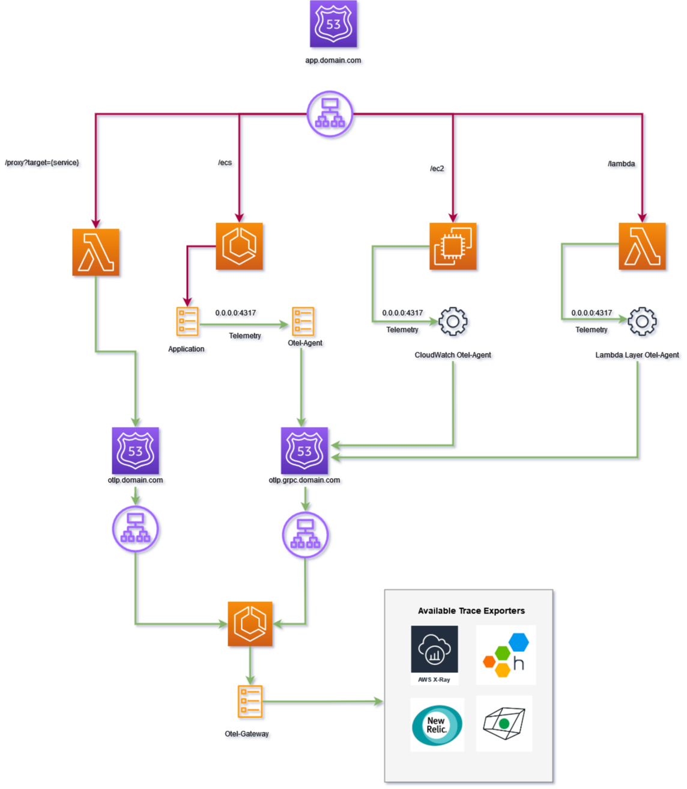

# Overview

This repository intends to provide useful templates and examples of various [OpenTelemetry](https://opentelemetry.io/)  hosting, security implementation patterns within such core AWS services as ECS (Elastic Container Service), EC2 (Elastic Cloud Compute), and Lambda.

The templates and examples provide a snapshot of functionality at a specific moment in time (late August 2021) and are not guaranteed to function in perpetuity.

These templates and examples are _not_ currently intended for production use (please see _Caveats and Assumptions_ later in this document for additional details).

## OpenTelemetry

OpenTelemetry is a vendor-agnostic observability framework for instrumenting, generating, collecting, and exporting telmetry data. The OpenTelemetry Protocol (OTLP) is vendor neutral, which allows you to send telemetry to multiple backends or change backends entirely&mdash;all without rewriting your code.

OpenTelemetry collectors include both **Agents**, a collector instance running with the application or on the same host as a sidecar or daemonset, and a **Gateway**, a standalone service deployed once per data center or region.

The Agent collectors enables applications to offload responsibilities including batching, retry, encryption, and more. This Agent can also enhance telemetry data with metadata such as custom tags or infrastructure information. This Agent pattern frequently simplifies the client implementation of the OpenTelemetry instrumentation. 

The Gateway collectors run as a standalone service and can offer advanced capabilities that include tail-based sampling. A Gateway collector can limit the number of egress points required to send data and consolidate API token management. If a gateway cluster is deployed, it usually receives data from Agents deployed within an environment.

Enterprise vendors who support OpenTelemetry Protocol (OTLP) include AWS, Datadog, Dynatrace, HoneyComb, and New Relic (among others).

Over time, the OpenTelemetry protocol will provide support for telemetry data like _traces_, _metrics_, and _logs_. Currently, only tracing has been released as a generally available, production quality release. Check back on the [OpenTelemetry component status](https://opentelemetry.io/status/) for updates on the development lifecycle for other telemetry data, e.g., metrics and logs.

## Dependencies

These examples assumes you have at least the following tools/services installed and are somewhat fluent in their use:

1. [Terraform (v1.0.x)](https://www.terraform.io/)
1. [Docker](https://www.docker.com/)
1. [Python (v3.8.x)](https://www.python.org/downloads/)
1. [AWS CLI](https://aws.amazon.com/cli/)

You may optionally use [K6](https://k6.io/) to generate load for your services once they exist. See [load test](./load-test/README.md) documentation for additional details. 

## Getting Started

The [examples](./examples/README.md) folder has some code samples to help familiarize yourself with some core OpenTelemetry concepts on your local machine before developing, deploying, and instrumenting more complex applications in AWS.

## OpenTelemetry and Application Architecture

The architecture diagram below shows the hosting pattern for [OpenTelemetry collectors](https://opentelemetry.io/docs/concepts/data-collection/#deployment) and our sample application. 

Second, the OpenTelemetry configuration for the Gateway service transmits data to [HoneyComb](https://www.honeycomb.io/blog/all-in-on-opentelemetry/). If you're not interested in transmitting telemetry to HoneyComb, remove these configuration lines. Alternatively, HoneyComb has an accessible and easy to use [free tier](https://www.honeycomb.io/pricing/) that you may want to consider.

## Security

An initial version of this example repo included a self-hosted authentication server to be used in conjunction with the `bearertokenauth`. However, support for this extension was _not_ available in the AWS Distro for OpenTelemetry [ADOT] across all the referenced services (ECS, EC2 and Lambda).

The example authentication flow is now included in a separate, [public repository](https://github.com/ericksoen/opentelemetry-examples-auth). Alternatively, you can reference the [auth](https://github.com/ericksoen/opentelemetry-examples/tree/auth) tag for this repository instead.

## Deployment

Before you deploy any application infrastructure, you first need to create the images (Gateway, Agent, and Application) and package (Lambda) that the infrastructure depends on. 

Creating the images and packages can be executed in any sequence, but the recommendation is to follow the same order used to deploy the infrastructure:

1. OpenTelemetry Agent Collector image
1. Build Application
   +  Note: this currently excludes the application build process for the EC2 service endpoint, which is packaged during the infrastructure deployment as S3 objects and then installed as part of application bootstrapping

Once you have created the necessary images and packages, deploy the infrastructure components in the recommend sequence. Please see the [infrastructure README](./infra/README.md) for additional guidance.

### Generating trace data

After packaging and deploying your applications, you can start to generate trace data and visualize it via one or more of the configured backends (Jaeger, HoneyComb, etc.).

To generate trace data, navigate to the demo site landing page (a Terraform output value from the application infrastructure deployment).

The landing page includes links to make HTTP requests to each of the applications behind our load balancer, `/ecs`, `/ec2`, and `/lambda`, respectively. 

The request flow from the root endpoint is as follows: `/ecs --> /ec2 --> /lambda`. Each of the endpoints can also be invoked independently and calls any downstream endpoints.

The landing page also includes a link to the Jaeger UI. Jaeger is an open source application that provides an ingest endpoint and UI. This allows you to visualize trace data, especially if you elect to disable HoneyComb ingest.

## Assumptions and Caveats

### Assumptions

This application is for demonstration purposes only and not intended as production-quality infrastructure and application code. As a result, some assumptions have been made about your infrastructure and environment.

Please note that your experience deploying this infrastructure may differ if some of these assumptions are not true for your environment.

1. This infrastructure will be deployed into the VPC of single AWS region
1. A single VPC can be identified using one or more of the provided [VPC filter criteria](https://docs.aws.amazon.com/AWSEC2/latest/APIReference/API_DescribeVpcs.html) 
1. Public and private subnets that belong to the VPC above can be identified using one or more provided [subnet filter criteria](https://docs.aws.amazon.com/AWSEC2/latest/APIReference/API_DescribeSubnets.html)
1. An Elastic Container Repository (ECR) already exists for your images
1. A domain and Route53 hosted zone exist that will serve as the _main_ domain for the subdomains created by this project

### Caveats

The caveats noted below attempt to describe some of the technical issues that limit running this service as a production-quality implementation.

1. Some secrets such as the HoneyComb write key appear in plain-text in both the AWS SSM Parameter Store and the Terraform state file
1. ECR images are pushed to a single repository and differentiated by the image tag
1. Other than secure communication offer HTTPS, this example implementation provides minimal direction on securing your OpenTelemetry collector (see [Security](#Security))

## Open Issues

1. [Add custom attributes to Lambda via tracer](https://github.com/open-telemetry/opentelemetry-lambda/issues/122)
1. [Add attributes to Lambda span via processor](https://github.com/open-telemetry/opentelemetry-lambda/issues/121)

## Resources

1. [OpenTelemetry](https://opentelemetry.io/)
1. [AWS Distro for OpenTelemetry](https://aws-otel.github.io/docs/introduction/)
1. [HoneyComb is All-In on OpenTelemetry](https://www.honeycomb.io/blog/all-in-on-opentelemetry/)
1. [AWS Observability Recipes](https://aws-observability.github.io/aws-o11y-recipes/)
